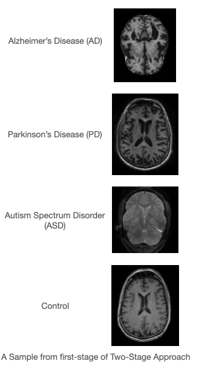

# Two-Stage-Approach

Comparison of Alzheimer's Disease, Parkinson's Disease, Autism Spectrum Disorder, and Control Classification using
One-Stage Approach and Two-Stage Approach

# Data Preparation

The datasets used in this project are available at the following links:

- [Alzheimer's Disease](http://adni.loni.usc.edu/methods/mri-tool/standardized-mri-data-sets/)
- [Parkinson's Disease](http://www.ppmi-info.org/access-data-specimens/download-data)
- [Autism Spectrum Disorder](https://www.frontiersin.org/10.3389/conf.fninf.2013.09.00041/event_abstract)
- [Brain Tumor Detection](https://www.kaggle.com/ahmedhamada0/brain-tumor-detection) *(Control Only)*



Separate each disease into different folder with corresponding disease names

One-Stage Approach Dataset Structure:
```
${ROOT}
└── data/    
    ├── LMCI/    
    ├── EMCI/
    ├── MCI/
    ├── SMC/
    ├── Prodomal/
    ├── PD/
    ├── ASD/
    └── Control/
```

Two-Stage Approach Dataset Structure:
```
${ROOT}
└── data/    
    ├── ADNI/
    |   ├── LMCI/
    |   ├── EMCI/
    |   ├── MCI/
    |   └── SMC/
    ├── PPMI/
    |   ├── Prodomal/
    |   └── PD/
    ├── ASD/
    └── Control/
```

## Getting Started:
GPU used: Tesla P100 (16 GB) from Kaggle

Requirement:

```shell script
pip install -U -r requirements.txt
```

# Execution
- **One-Stage Approach**:
    - Architecture
        
    - Execute the "One-Stage-Approach.py"
    [ResNet50_V2](https://www.tensorflow.org/api_docs/python/tf/keras/applications/resnet_v2/ResNet50V2). Obtained Accuracy: 91.02%
        ```shell script
        python One-Stage-Approach.py
        ```
    The model will be saved as ***8-way_resnet_model.h5***
- **Two-Stage Approach**
    - Architecture
        
    
    First Stage: AlexNet -> *Accuracy=94.29%*
    
    Second Stage: ResNet50_V2
    1. Alzheimer's Disease = 78.10%
    2. Parkinson's Disease = 97.29%

            Note:
                Autism Spectrum Disorder and Control doesn't contain any further classification so they are not trained in second stage.   
    
    Running Two-Stage Approach:
    ```shell script
    python Two-Stage-Stage-1.py
    python Two-Stage-PD(Stage-2).py
    python Two-Stage-AD(Stage-2).py
    ```
    Note: Make Sure **utils.py** is in the same directory as the python files
    
    All the models will be saved in the ***models*** folder <br>
  Link for Research paper: <a href="https://ieeexplore.ieee.org/document/10101037">Deep-learning Residual Network Based Image Analysis for An Efficient Two-Stage Recognition of Neurological Disorders </a>
